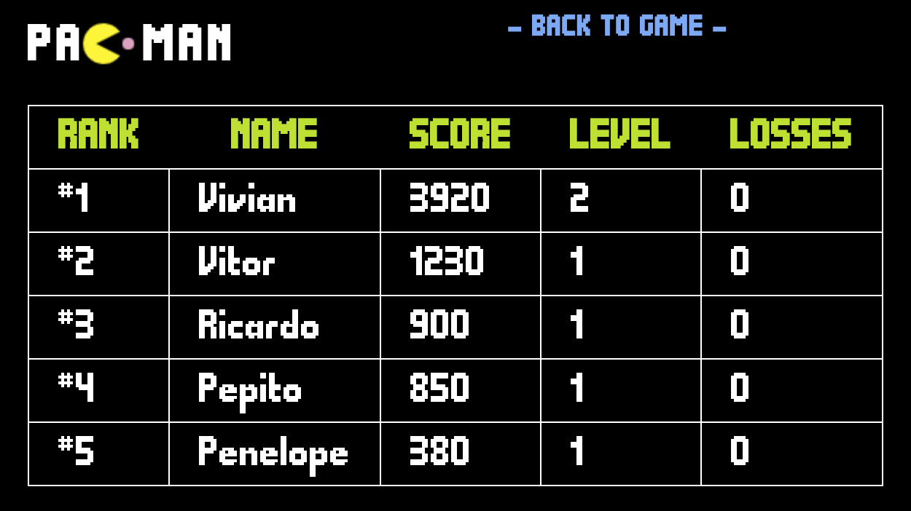

# Pac-Man with Elastic Stack

Many people know how awesome the [Elastic Stack](https://www.elastic.co/elastic-stack) is and how powerful each technology from the stack can be.
However, most users struggle to find an end-to-end example based on time series data that makes usage of important features of the stack in a simple to understand scenario.
If that's you then you are in the right place. Meet Pac-Man with Elastic Stack.

<center></center>

This project contains an implementation of the game [Pac-Man](https://en.wikipedia.org/wiki/Pac-Man) written in JavaScript.
This game can be automatically installed in a cloud provider (AWS, Azure, or Google Cloud) so that many users can play the game simultaneously.
As they play, events from the game will be created and stored in Elasticsearch.

<center>
   <table>
      <tr>
         <td></td>
         <td></td>
      </tr>
   </table>
</center>

<center>
   <table>
      <tr>
         <td width="500" height="200"></td>
         <td width="500">With this data stored in Elasticsearch the game continuously reads the indices and compute in near real-time a scoreboard. The scoreboard lists all the players and sorts them firstly based on their score, then based on their level, and lastly based on the number of their losses. The computation of the scoreboard makes usage of features like <a href="https://www.elastic.co/guide/en/elasticsearch/reference/current/search-search.html">searches</a> and <a href="https://www.elastic.co/guide/en/elasticsearch/reference/current/search-aggregations.html">aggregations</a>, and advanced features such as <a href="https://www.elastic.co/guide/en/elasticsearch/reference/current/transform-apis.html#transform-apis">transforms</a> and <a href="https://www.elastic.co/guide/en/elasticsearch/reference/current/data-streams.html">data streams</a> can also be optionally enabled.</td>
      </tr>
   </table>
</center>

## Building the project

The first thing you need to do to start using this partitioner is building it. In order to do that, you need to install the following dependencies:

- [Java 11+](https://openjdk.java.net/)
- [Apache Maven](https://maven.apache.org/)

After installing these dependencies, execute the following command:

```bash
mvn clean package
```

### What about the other topics?

As you may know in Kafka a consumer can subscribe to multiple topics, allowing the same consumer to read messages from partitions belonging to different topics.
Because of this the assignor ensures that only the topic specified in the configuration will have its partitions assigned to the consumers using the bucket priority logic.
The other topics will have their partitions assigned to consumers using a fallback assignor.

Here is an example of configuring the fallback assignor to round-robin:

```bash
configs.setProperty(BucketPriorityConfig.FALLBACK_ASSIGNOR_CONFIG,
   "org.apache.kafka.clients.consumer.RoundRobinAssignor");
```

If you don't configure a fallback assignor explicitly, Kafka's default assignor will be used.

# License

This project is licensed under the [Apache 2.0 License](./LICENSE).
