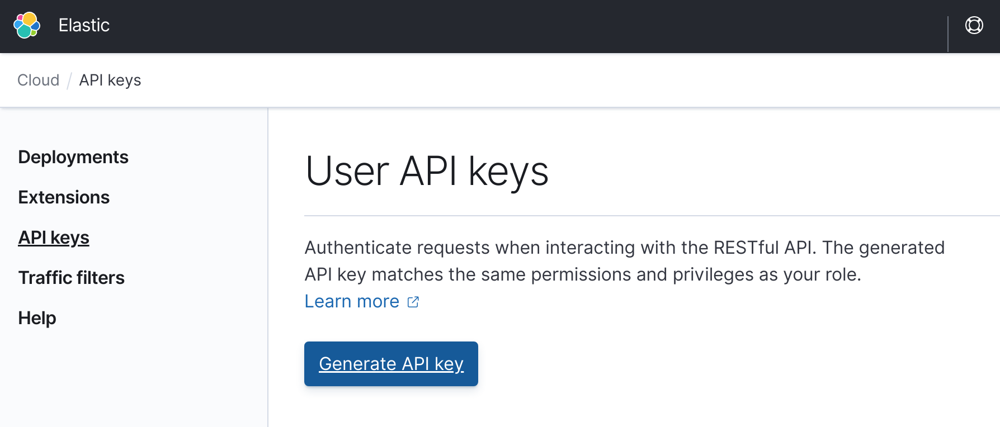

# Pac-Man with Elasticsearch

Many people already know how awesome [Elasticsearch](https://www.elastic.co/elasticsearch) is and how it enables ***speed***, ***scale***, and ***relevance*** for data.
However, it is hard to find examples that explore how Elasticsearch work with time series data in a form of data streams, as well as how it enables the computation of those data streams in near real-time.
If that's you then you are in the right place. Meet **Pac-Man with Elasticsearch**.

<center></center>

This project contains an implementation of the game [Pac-Man](https://en.wikipedia.org/wiki/Pac-Man) written in JavaScript.
This game can be automatically installed in a cloud provider ([AWS](https://aws.amazon.com), [Azure](https://azure.microsoft.com), or [Google Cloud](https://cloud.google.com)) so that many users can play the game simultaneously.
As they play, events from the game will be created and stored in Elasticsearch.

<center>
   <table>
      <tr>
         <td></td>
         <td></td>
      </tr>
   </table>
</center>

<center>
   <table>
      <tr>
         <td width="500" height="200"></td>
         <td width="500">With all this data stored in Elasticsearch the game continuously reads the indices and computes in near real-time a scoreboard. The scoreboard lists all the available players and sorts them firstly based on their score, then based on their level, and lastly based on the number of their losses. The scoreboard is built based on features like <a href="https://www.elastic.co/guide/en/elasticsearch/reference/current/search-search.html">searches</a> and <a href="https://www.elastic.co/guide/en/elasticsearch/reference/current/search-aggregations.html">aggregations</a>, and advanced features such as <a href="https://www.elastic.co/guide/en/elasticsearch/reference/current/transform-apis.html#transform-apis">transforms</a> and <a href="https://www.elastic.co/guide/en/elasticsearch/reference/current/data-streams.html">data streams</a> are also enabled.</td>
      </tr>
   </table>
</center>

During the installation of the game a new deployment is created on [Elasticsearch Service](https://www.elastic.co/elasticsearch/service).
This is required for three reasons.
Firstly because it is where the data will be stored.
A deployment on Elasticsearch Service contains a fully functional Elasticsearch cluster which is used as the data store for the events.
Secondly because it allows you to focus on the application code without wasting time with infrastructure plumbing.
Elasticsearch Service is a managed service that handles the dirty details of having an Elastic Stack infrastructure that is highly available.
Finally, both the game and its data need to be co-located for performance reasons since it makes sense to have the generated data stored in the same provider and in the same region that the game is installed.

## Pre-requisites

You will need a machine running Linux, Mac, or [WSL](https://docs.microsoft.com/en-us/windows/wsl/about) to run the installation.
Also, the following software must be installed:

<table>
  <tr border="1">
    <td>Terraform</td>
    <td><a href="https://www.terraform.io/downloads.html">https://www.terraform.io/downloads.html</a></td>
  </tr>
  <tr border="1">
    <td>jq</td>
    <td><a href="https://stedolan.github.io/jq">https://stedolan.github.io/jq</a></td>
  </tr>
  <tr border="1">
    <td>curl</td>
    <td><a href="https://curl.haxx.se/download.html">https://curl.haxx.se/download.html</a></td>
  </tr>
</table>

## 1. Preparing the Game for Install

The game was developed to automatically create a deployment in Elasticsearch Service, to automatically deploy the application in the provider, and glue them together for a superior user experience.
This means that there is not much expected from you except for providing the required credentials to make all of this happen.
This section will walk you through in what is required to install the game.

Generally speaking here is the information that you need to provide:

- **Information about Elastic Cloud**: You are going to provide this information by creating a file called `elastic.settings` and provide the API key necessary to create a deployment on Elasticsearch Service.
- **Information about the provider**: You are going to provide this information by creating a file called `provider.settings` and providing the access details. The specific parameters are unique to each provider but the template that comes with this project will give you a hint about what is necessary.
- **General customization of the game**: You are going to provide this information by creating a file called `general.settings` and providing the customization.

The information provided here can be reused across different installations.
Ideally you will create these settings files once and reuse them across different installations, changing only the parameters that require update for a given install.

### 1.1 Information about Elastic Cloud

- Create a new file called `elastic.settings` based on the template `elastic.settings.template`.
  ```bash
  cp elastic.settings.template elastic.settings
  ```
- Open the file `elastic.settings` and provide the API key.
  ```bash
  EC_API_KEY=${EC_API_KEY}
  ```
  You can create a new API key on Elasticsearch Service using the UI as shown below.
  
  

### 1.2 Information about the provider

- Create a new file called `provider.settings` based on the template `provider.settings.template`.
  ```bash
  cp provider.settings.template provider.settings
  ```
- Open the file `provider.settings` and configure which provider and region will be used.
  ```bash
  SELECTED_PROVIDER=${SELECTED_PROVIDER}
  SELECTED_REGION=${SELECTED_REGION}
  ```

- Also in the file `provider.settings` configure the credentials of the provider.
  ```bash
  ########## AWS ##########

  AWS_ACCESS_KEY_ID=${AWS_ACCESS_KEY_ID}
  AWS_SECRET_ACCESS_KEY=${AWS_SECRET_ACCESS_KEY}

  ######### Azure #########

  ARM_SUBSCRIPTION_ID=${ARM_SUBSCRIPTION_ID}
  ARM_TENANT_ID=${ARM_TENANT_ID}
  ARM_CLIENT_ID=${ARM_CLIENT_ID}
  ARM_RESOURCE_GROUP=${ARM_RESOURCE_GROUP}

  ###### Google Cloud #####

  GOOGLE_CLOUD_KEYFILE_JSON=${GOOGLE_CLOUD_KEYFILE_JSON}
  GOOGLE_CLOUD_PROJECT=${GOOGLE_CLOUD_PROJECT}

  ```

  If you are unsure about how to obtain the credentials, check the documentation from the chosen provider.

### 1.3 General customization of the game

- Create a new file called `general.settings` based on the template `general.settings.template`.
  ```bash
  cp general.settings.template general.settings
  ```
- Open the file `general.settings` and change the variables to customize the game.
  ```bash
  SELECTED_PROVIDER=gcp
  SELECTED_REGION=us-east4

  APP_NAME=app-name
  DISPLAY_COUNT=10

  DATA_STREAM_ENABLED=true

  TRANSFORM_ENABLED=true
  TRANSFORM_FREQUENCY=1s
  TRANSFORM_DELAY=1s
  ```

You should customize at least the `APP_NAME` variable since it defines how part of the game URL will look like, as well as how some backend resources will be named.
The table below explains the meaning and usage of each parameter.

<table>
  <tr border="1">
    <td align="left"><b>Parameter</b></td>
    <td align="left"><b>Description</b></td>
    <td align="center"><b>Mandatory</b></td>
    <td align="center"><b>Default Value</b></td>
  </tr>
  <tr border="1">
    <td align="left">SELECTED_PROVIDER</td>
    <td align="left">The cloud provider used for the game. The value set for this parameter will dictate which provider will be used for both the Elasticsearch cluster and for the game itself.</td>
    <td align="center">Yes</td>
    <td align="center">gcp</td>
  </tr>
  <tr border="1">
    <td align="left">SELECTED_REGION</td>
    <td align="left">The region from the cloud provider where the game will be deployed. The value set for this parameter will dictate which provider will be used for both the Elasticsearch cluster and for the game itself.</td>
    <td align="center">Yes</td>
    <td align="center">us-east4</td>
  </tr>
  <tr border="1">
    <td align="left">APP_NAME</td>
    <td align="left">Allows you to customize part of the game URL and how some backend resources will be named.</td>
    <td align="center">Yes</td>
    <td align="center">app-name</td>
  </tr>
  <tr border="1">
    <td align="left">DISPLAY_COUNT</td>
    <td align="left">Defines how many rows the scoreboard page will display by default. You can override this setting in the browser by using the query parameter <code>displayCount</code>.</td>
    <td align="center">No</td>
    <td align="center">10</td>
  </tr>
  <tr border="1">
    <td align="left">DATA_STREAM_ENABLED</td>
    <td align="left">Enabled the usage of the feature <a href="https://www.elastic.co/guide/en/elasticsearch/reference/current/data-streams.html">data streams</a> for the index used to store the events from the game. If enabled it will automatically rollover when the index size reaches 1GB or if it is active for over a week, allowing you to implement better storage management practices by applying hot, warm, cold, and delete policies. Turning this setting off will force the game to store all events in a single index.</td>
    <td align="center">No</td>
    <td align="center">true</td>
  </tr>
  <tr border="1">
    <td align="left">TRANSFORM_ENABLED</td>
    <td align="left">Enabled the usage of the feature <a href="https://www.elastic.co/guide/en/elasticsearch/reference/current/transform-apis.html#transform-apis">transforms</a> for the index used to store the scoreboard. If enabled it will automatically create and start the transform in a continuous mode. This setting enables the scoreboard to be computed in the background and asynchronously with the UI layer simply consuming the computed data. Turning this setting off will force the UI layer to request the computation of the scoreboard every time it needs.</td>
    <td align="center">No</td>
    <td align="center">true</td>
  </tr>
  <tr border="1">
    <td align="left">TRANSFORM_FREQUENCY</td>
    <td align="left">If the parameter <code>TRANSFORM_ENABLED</code> is set to true this parameter controls the interval between checks for changes in the index that stores the events from the game.</td>
    <td align="center">No</td>
    <td align="center">1s</td>
  </tr>
  <tr border="1">
    <td align="left">TRANSFORM_DELAY</td>
    <td align="left">If the parameter <code>TRANSFORM_ENABLED</code> is set to true this parameter controls the time delay between the current time and the latest input data time from the index that stores the events from the game.</td>
    <td align="center">No</td>
    <td align="center">1s</td>
  </tr>
</table>

## 2. Installing and Uninstalling the Game

- Execute the script `install.sh` to install the game
  ```bash
  sh install.sh
  ```

- Execute the script `uninstall.sh` to uninstall the game
  ```bash
  sh uninstall.sh
  ```

# License

This project is licensed under the [Apache 2.0 License](./LICENSE).